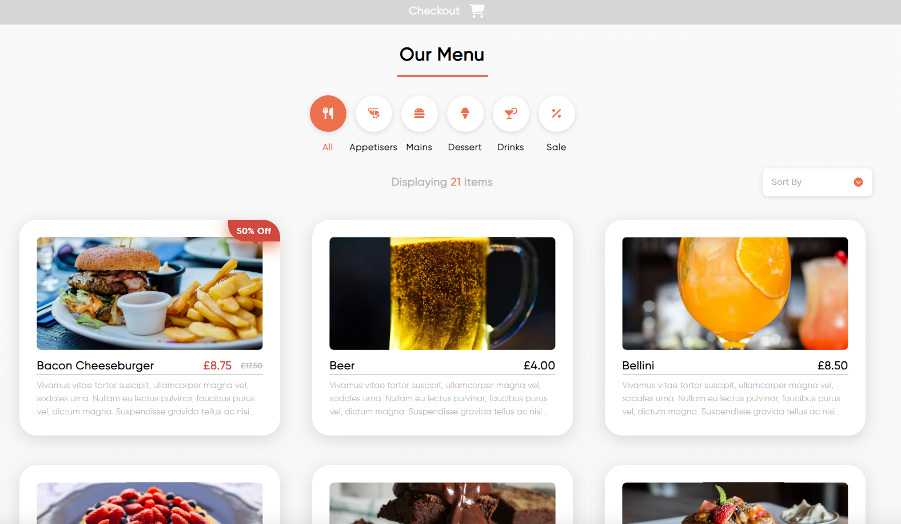
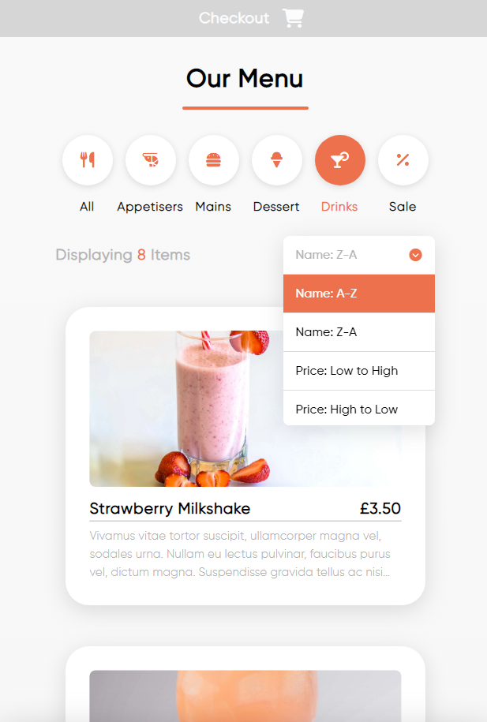
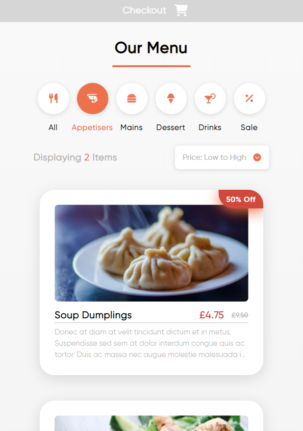
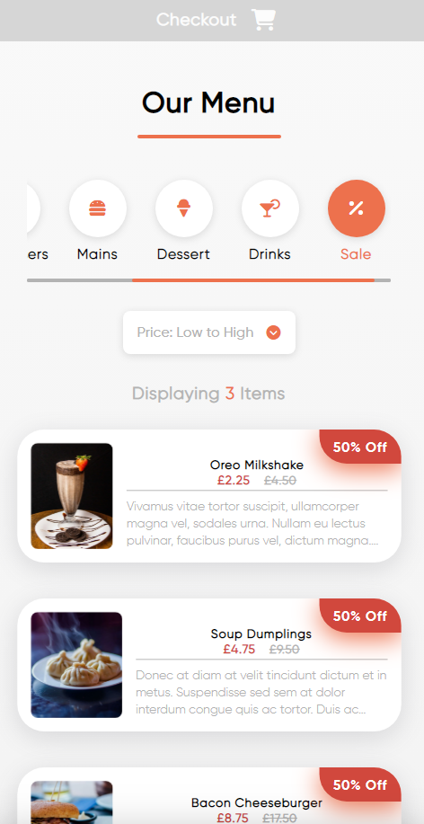
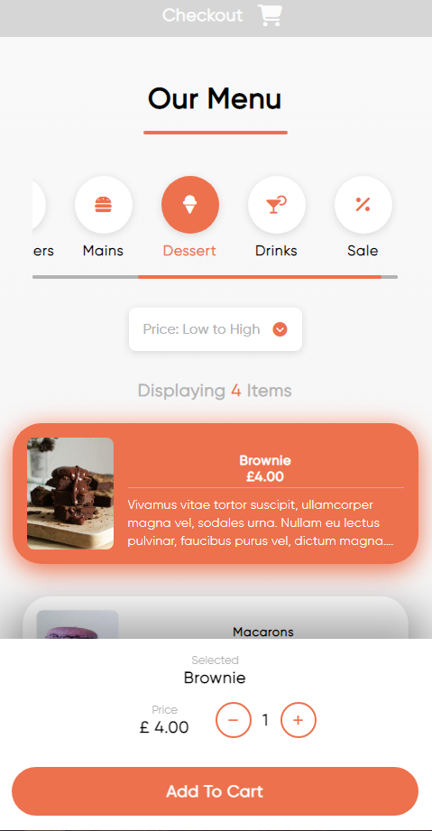
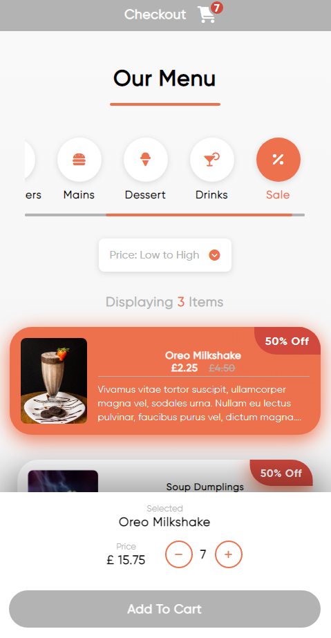
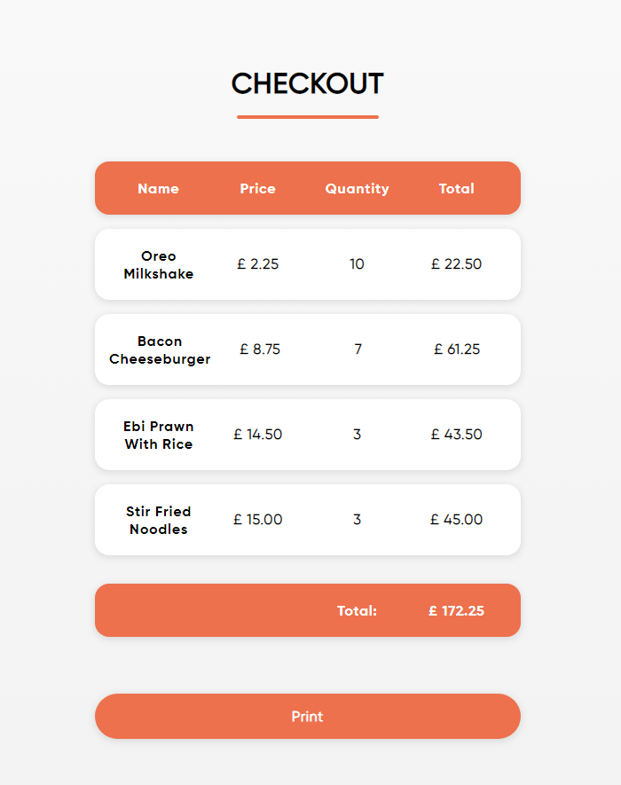

# Food Order Menu

Used vanilla JavaScript, HTML and CSS (with SASS) to create a responsive, functional food ordering web app.

Live code can be found here: [link](https://maxbedford-food-order-menu.netlify.app/)

---

Below are some simple screenshots of the Food Order Menu:

## Page at full size

Page at full size displays 3 columns. Page contains filters for each product, filtered by 'tag' assigned to each object in an array. Also a 'sort by' feature which opens up a drop down menu.

## Page at medium size

Here we are highlighting that page responsiveness, displaying 1 column, the functionality of the 'drinks' filter, and the working dropdown menu filters which sort the list appropriately.

## Adding "sale" Tag affects item

By adding the word 'sale' to an objects 'tags' key, CSS will update the product to display the sale percentage in the top right, and the relative price cut.

## Page at smallest size

At the smallest size the page will restructure to fit the screen, moving images to the left and reducing font size. The filter buttons will be slightly hidden, but can be scrolled through horizontally.

## Selected item effect

When an item is clicked, CSS will make the item stand out orange, and bring up a menu at the bottom of the screen which can be hidden by clicking elsewhere on the page.

## Checkout counter updates when 'Add To Cart' clicked

From here, you can use the plus and minus to add as many items into the cart after pressing 'add to cart'. This will push the items into a new array, and update the top checkout bar to be opaque, clickable, and have a working item counter.

## Checkout screen with print button

Once the 'Checkout' button is clicked, save the new array into local storage and open up a new page displaying all items in the cart, the total price, and the ability to print out the page.

---
